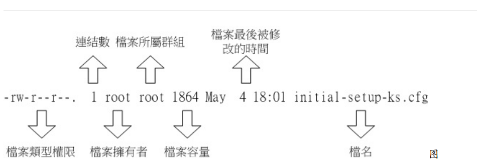
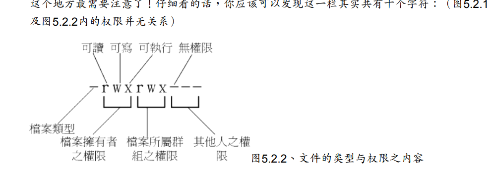

# 文件权限详解
**使用ls -l查看文件详情**

字段说明

文件权限字段说明  
## 文件类型字符
- 当为[ d ]则是目录，例如上表文件名为“.config”的那一行；
- 当为[ - ]则是文件，例如上表文件名为“initial-setup-ks.cfg”那一行；
- 若是[ l ]则表示为链接文件（link file）；
- 若是[ b ]则表示为设备文件里面的可供储存的周边设备（可随机存取设备）；
- 若是[ c ]则表示为设备文件里面的序列埠设备，例如键盘、鼠标（一次性读取设
备）。
- 若是[ s ]则表示为socket文件
## 文件权限
三个一组第一组为user，第二组为group，第三组为others
- [r]表示可读(read)
- [w]表示可写(write)，但不包含删除权限
- [x]表示可执行(execute)
## 目录权限
- [r] 表示具有读取目录结构列表的权限,即ls命令
- [w] 表示具有更改目录结构列表的权限,即在该目录下创建或删除文件,文件改名，文件移动
- [x] 表示具有进入该目录的权限,即cd命令
::: tip
需要目录的x权限才能读取，修改，执行目录的文件，w权限可以删除，没有r权限只是不能ls查看目录文件。
## 改变权限命令
### `chgrp`改变文件所属群组
```shell
chgrp [-R] dirname/filename
# -R 递归更改文件或目录的所属群组
```
### `chown`改变文件拥有者
```shell
chown [-R] user:group dirname/filename
# -R 递归更改文件或目录的拥有者或者所属群组
```
### `chmod`改变文件权限
#### 数字方法改变
```shell
chmod [-R] xyz dirname/filename
# x,y,z为数字，代表三组用户的权限
# 是rwx对应的二进制数
```
#### 符号方法改变
```shell
 chmod [-R]| u g o a | +（加入） -（除去） =（设置） | r w x | 文件或目录 |
# u 表示用户，g 表示群组，o 表示其他人，a 表示所有人
#example
chmod u+x,a=rw,o-r filename
```
