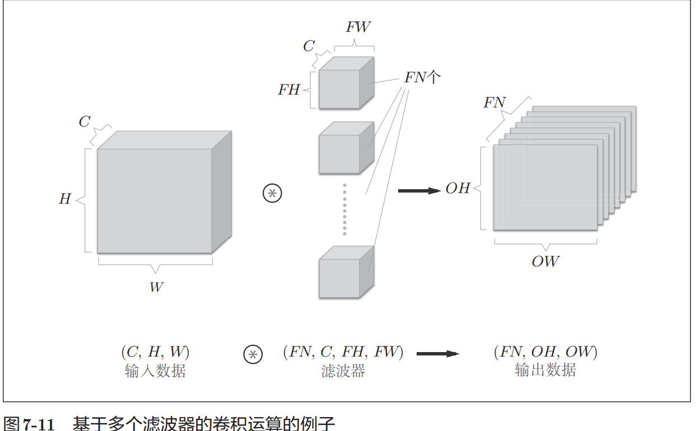
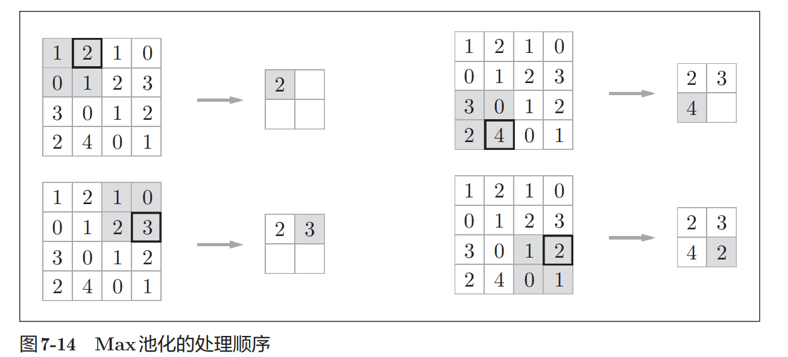

# Convolutional Neural Networks

之前介绍的全连接的神经网络中使用了全连接层（Affine层）。在全连接
层中，相邻层的神经元全部连接在一起，输出的数量可以任意决定。
全连接层存在什么问题呢？那就是数据的形状被“忽视”了。比如，输
入数据是图像时，图像通常是高、长、通道方向上的3维形状。但是，向全
连接层输入时，需要将3维数据拉平为1维数据。实际上，前面提到的使用
了MNIST数据集的例子中，输入图像就是1通道、高28像素、长28像素
的（1, 28, 28）形状，但却被排成1列，以784个数据的形式输入到最开始的
Affine层。
图像是3维形状，这个形状中应该含有重要的空间信息。比如，空间上
邻近的像素为相似的值、RBG的各个通道之间分别有密切的关联性、相距
较远的像素之间没有什么关联等，3维形状中可能隐藏有值得提取的本质模
式。但是，因为全连接层会忽视形状，将全部的输入数据作为相同的神经元
（同一维度的神经元）处理，所以无法利用与形状相关的信息。
而卷积层可以保持形状不变。当输入数据是图像时，卷积层会以3维
数据的形式接收输入数据，并同样以3维数据的形式输出至下一层。因此，
在CNN中，可以（有可能）正确理解图像等具有形状的数据。
## filter 
- filter is a matrix of weights that are learned during the training process.
## padding
- padding is a technique used to preserve the spatial dimensions of the input volume.
## stride
- stride is the number of pixels by which we slide the filter matrix over the input volume.
# pooling   
池化是缩小高、长方向上的空间的运算。
池化层和卷积层不同，没有要学习的参数。池化只是从目标区域中取最
大值（或者平均值），所以不存在要学习的参数。  
输入数据发生微小偏差时，池化仍会返回相同的结果。因此，池化对  
输入数据的微小偏差具有鲁棒性。
